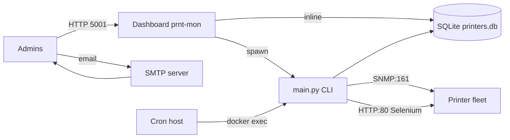
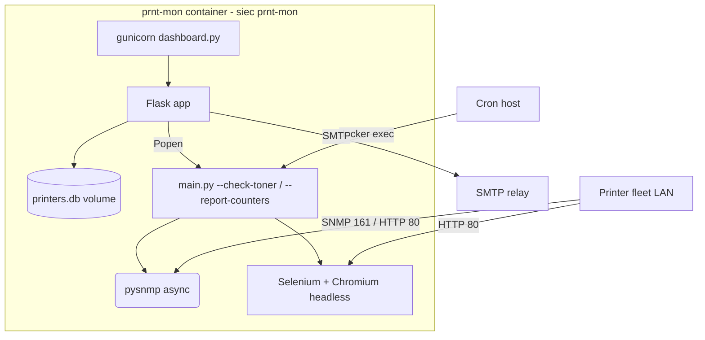

# PLAN.md — printer-monitor (prnt-mon)

> Pipeline: `/10 Plan` · Stage: Brownfield (audyt zakończony) · Date: 2026-08-12
> Stack: Python · Okres: iteracja `/20` (Safety & Stability) + `/30` (Code)
> Zakres: naprawa krytycznych defektów z audytu K1–K3, W4–W11, następnie rozbudowa

---

## [LEAN_CANVAS]

| Blok | Treść |
|---|---|
| **Problem** | Ręczne sprawdzanie tonerów i liczników stron w flocie drukarek; brak powiadomień o niskich stanach; brak historii zużycia |
| **Segment klientów** | IT/admin wewnętrzny (środowisko firmowe/urzędowe z flotą 10–100 urządzeń) |
| **Unikalna wartość** | Automatyczny odczyt SNMP + web scraping (Selenium), alerty e-mail z cooldownem, dashboard, raporty Excel; per-urządzeniowe niestandardowe OID-y |
| **Rozwiązanie** | Istniejąca aplikacja CLI + Flask (audyt wykonany; wersja 1.0 wymaga utwardzenia) |
| **Kanały** | Deployment wewnętrzny (kontener prywatny `prnt-mon`), cron |
| **Przychody** | n/d (narzędzie wewnętrzne) |
| **Koszty** | Serwer, Chromium, skrzynka SMTP, utrzymanie |
| **Kluczowe metryki** | % udanych przebiegów, % odczytów urządzeń, opóźnienie alertu, % wysłanych alertów |
| **Przewaga** | Podwójne źródło danych (SNMP + WWW), custom OID-y, cooldown, historia w SQLite z fallbackiem HISTORY |

## [MVP_DEFINITION]

### MUST-HAVE (v1.0 — iteracja Safety & Stability, 7 pozycji)

1. **FIX-K2** — Usunięcie zduplikowanej `get_counters_snmp` (main.py:542/575); przywrócenie ścieżki custom OID-ów liczników; TypeError przestaje zabijać przebieg — fallback OFFLINE/HISTORY działa
2. **SEC-K1** — Rotacja hasła SMTP (wykonanie u CEO) + **paczka narzędziowa**: skrypt `git filter-repo` (kopie, weryfikacja blobów), checklista rotacji, instrukcja `SEC-K1-INSTRUCTIONS.md` (kroki, weryfikacja, zgłoszenie wewnętrzne)
3. **SEC-K3** — Dashboard utwardzony: `debug=False`, gunicorn zamiast dev-server, autoryzacja (token Bearer + CSRF), bind `127.0.0.1`/interfejs wewnętrzny
3b. **INTEG-SIM** — Symulator floty: SNMP responder (pysnmp CommandResponder:161) + HTTP mock (:80/5002, strony zgodne z formatem Selenium: `DeviceName`, `TotalFullColor/TotalBlackColor`) + seed **12 fikcyjnych drukarek** (SQLite/CSV) + CLI rotacji stanów (tonery, liczniki, offline, back-online) — `@ops`
3c. ~~EXP-01 (etap 2)~~ — **ZDJĘTE WSCO: ekspozycja lokalna** (CEO 2026-08-12): dashboard bind `127.0.0.1:5001` tylko na WSL; domena testowa nieużywana teraz; ewentualny publiczny dostęp później przez cloudflared CNAME (NICE)
4. **OPS-W4** — Prawdziwy `.gitignore` (aktywny), sanityzacja repo: żadnych sekretów/db/logów w git
5. **OPS-W5** — Lock PID-based (plik + PID + mtime): main.py też tworzy lock, stale-lock wykrywany i czyszczony; koniec równoległych przebiegów cron
6. **OPS-W6** — Escaping HTML w raportach e-mail (html.escape), walidacja adresów IP z CSV (ipaddress), obsługa błędów per-drukarka nieprzerywająca pętli
7. **ENV-W7/W8** — Reprodukowalne środowisko: `requirements.txt` (pinned) w repo, Dockerfile/instrukcja dla kontenera z Chromium headless, `chrome_binary`/`snmp_timeout`/`snmp_retries` z configu (W10: timestamp alertu tylko po udanej wysyłce)

### SHOULD-HAVE (v1.1+)
- Testy pytest (rdzeń: parsing tonerów, progi alertów, liczniki, lock) — cel: core coverage ≥70%
- Współbieżność odczytów (SNMP już async; web scraping równoległy z ograniczeniem) — skrócenie czasu przebiegu
- Rotacja logów (`cron.log` → `logging.handlers.RotatingFileHandler`)
- CI (GitHub Actions: lint + testy; bez potrzeby drukowarek — mocki)

### NICE-TO-HAVE (v2.0+)
- Dashboard: wykresy historii liczników, lista offline, sortowanie po stanie
- Walidacja/kreator `config.ini` + `encrypt_util.py` z flagą `--write-to-config`
- IPv6, wiele community per printer, HTTP(S) auth dla web scrapingu
- Powiadomienia alternatywne (webhook/Teams/Slack)

### KPI
1. Udane przebiegi: **100%** (0 wyjątków nieobsłużonych)
2. Skuteczność odczytu urządzeń: **≥95%** (SNMP lub WWW)
3. Skuteczność wysyłki alertów SMTP: **≥99%** (przy poprawnym koncie)
4. Testy pokrycia rdzenia: **≥70%**
5. Czas przebiegu: **≤ 90 s × liczba urządzeń** (limit dokumentowany)

## [TECH_STACK]

| Warstwa | Wybór | Uzasadnienie |
|---|---|---|
| Język | Python 3.12 (kontener `python:3.12-slim`) | Zgodny z obecnym kodem; deps w kontenerze |
| Backend CLI | `main.py` (argparse) + pysnmp (hlapi asyncio) + Selenium/BeautifulSoup | Bez zmian architektury; fix deduplikacji |
| Selenium | Selenium w/ Chromium headless (container apt `chromium`) | Źródło danych liczników dla modeli bez MIB SNMP |
| Dashboard | Flask + **gunicorn** (prod), Jinja2 + vanilla JS | Flask dev-server (debug) — RCE; gunicorn = prod |
| DB | SQLite (`printers.db`, kontynuacja) | Lokalna, wystarczająca, 0 konfiguracji |
| Auth dashboard | Wspólny klucz (env `DASH_AUTH_TOKEN`) + `@before_request` + CSRF (SameSite) | Prosty, bez frameworków |
| Raporty | pandas + openpyxl (istniejące) | Wymagane w 1 pozycji backlogu |
| Szyfrowanie | cryptography (Fernet) — kontynuacja, ale klucz poza repo (env/volume) | SEC-K1 |
| Infra | Kontener `prnt-mon` (sieć `prnt-mon`), cron na hoście → `docker exec` | Istniejące środowisko sesji |
| Harmonogram | cron host: toner 0/8/16, liczniki 1. dnia miesiąca | Jak w README |

## [DIAGRAMS]

### C4 Context

### C4 Container

## [PRODUCT_BACKLOG] (MoSCoW; oparty na audycie)

| ID | Story | MoSCoW | Mapowanie | Agent |
|---|---|---|---|---|
| US-01 | Jako admin chcę, aby odczyt liczników nie przerywał przebiegu przy drukarce offline, aby dostać kompletny raport | Must | FIX-K2 | @builder |
| US-02 | Jako admin chcę, aby custom OID-y liczników per drukarka działały, aby liczniki kolor/B&W były prawdziwe | Must | FIX-K2 | @builder |
| US-03 | Jako CEO/admin chcę, aby sekrety nie istniały w historii repo, aby ryzyko kompromitacji SMTP znikło | Must | SEC-K1 | @ops + CEO |
| US-04 | Jako admin chcę, aby dashboard miał auth i nie wystawiał debuggera, aby nikt obcy nie uruchamiał zadań/RCE | Must | SEC-K3 | @builder + @validator |
| US-05 | Jako admin chcę, aby zejście procesu nie blokowało na stałe kolejnych przebiegów, aby automatyzacja działała zawsze | Must | OPS-W5 | @builder |
| US-06 | Jako admin chcę, aby maile nie zawierały wstrzykniętego HTML z danych drukarki, aby raporty były bezpieczne | Must | OPS-W6 | @builder |
| US-07 | Jako operator chcę, aby środowisko było odtwarzalne (deps + chromium), aby wdrożenie na nowy serwer trwało minuty | Must | ENV-W7/W8 | @ops |
| US-08 | Jako deweloper chcę, aby rdzeń miał testy pytest z mockami SNMP/WWW, aby refaktory nie psuły progów alertów | Should | SHOULD-1 | @validator |
| US-09 | Jako admin chcę, aby przebieg był równoległy, aby 20+k drukarek kończyło się w minutach | Should | SHOULD-2 | @builder |
| US-10 | Jako admin chcę widzieć historię liczników na dashboardzie, aby śledzić zużycie w czasie | Could | NICE-1 | @builder |
| US-11 | Jako tester chcę symulatora 12 fikcyjnych drukarek z rotowalnymi stanami, aby testować alerty i dashboard bez realnej floty | Must | INTEG-SIM (DEC-03) | @ops |
| US-12 | Jako tester chcę scenariuszy rotacji (offline, toner niski/krytyczny, powrót online), aby deterministycznie sprawdzać progi i cooldown | Must | INTEG-SIM (DEC-03) | @ops |
| US-13 | Jako CEO chcę przeglądać dashboard lokalnie (127.0.0.1, za auth), aby testować bez wystawiania na internet | Must | SEC-K3 (bind lokalny) | @builder |
| US-14 | Jako CEO chcę opcjonalnego publicznego dostępu w przyszłości (cloudflared CNAME), gdyby zaszła potrzeba testów z zewnątrz | Could | NICE (EXP-01 przyszłość) | @ops |

## [CLARIFICATION_QUESTIONS] (grill-me — raport: `/opt/gabson/grill-reports/prnt-mon-2026-08-12.md`)

1. **Q1 [ROZWIĄZANE] Protokół docelowy liczników**: **SNMP** (CEO, 2026-08-12) — symulator: SNMP responder + HTTP mock (web scraping zostaje jako fallback)
2. **Q2 [ROZWIĄZANE] Ekspozycja**: **lokalnie na WSL** (CEO, 2026-08-12) — bez domeny publicznej, cloudflared tylko jako NICE na przyszłość
3. **Q3 [ROZWIĄZANE] Single-user**: tylko CEO — **Bearer token** (header, nie URL), CSRF
4. **Q4 [ROZWIĄZANE] SMTP testowe**: testowe dane wpisane do `config.ini` (kontener, marker `TEST`, backup `config.ini.bak`); progi alertów testowe 20%/5% dla szybszej weryfikacji symulatora
3. **Q3 [ROZWIĄZANE] Single-user**: tylko CEO — **Bearer token** (header, nie URL), CSRF
4. **Q4 [ROZWIĄZANE] SMTP testowe**: testowe dane wpisane do `config.ini` (kontener, zapisane w repo; marker `TEST`, backup `config.ini.bak`); progi alertów testowe 20%/5% dla szybszej weryfikacji symulatora

## [SKILLS_USED]

- `security-audit` — weryfikacja SEC-K1/K3 po implementacji (grep sekretów, podatności)
- `quality` — przegląd jakości zmian (main.py/dashboard.py)
- `guardian` — self-supervision przy operacjach na git historii i secretach
- `error-handling-patterns` — przeprojektowanie obsługi wyjątków per-drukarka
- `local-ci` — lokalne testy zamiast CI aż do SH

## [AGENTS_ON_DEMAND]

- `@builder` (backend/python) — implementacja MAIN (FIX-K2, US-05, US-06, US-09)
- `@validator` (testing + security) — testy pytest, review SEC-K3, audit poprodukcyjny
- `@ops` (infrastructure) — kontener: chromium, deps, Dockerfile, git filter-repo (SEC-K1), cron
- `@analyst` — weryfikacja danych po wdrożeniu (metryki KPI)

## [POC_RESULTS]

| PoC | Cel | Status |
|---|---|---|
| PoC-1: Chromium headless w kontenerze | Selenium działa w `python:3.12-slim` (apt chromium) | Planowane w `/20` (krok 0) — niskie ryzyko |
| PoC-2: Symulator floty | SNMP responder + HTTP mock + seed 12 drukarek działa w sieci `prnt-mon` | Planowane w `/20` (krok 1) — **zastępuje realną flotę** (DEC-03) |
| PoC-3: `git filter-repo` na historii | Potwierdzenie usunięcia blobów secret/konfig | Planowane w `/20` (krok 3) — test na kopii repo |

## [CLARITY_SCORE]

**9.5/10** — brownfield, audyt kompletny, wszystkie pytania grillowe rozwiązane (Q1 protoSNMP, Q2 lokalnie, Q3 single-user, Q4 testowe SMTP); jedyna reszta: rotacja SMTP = Twoja akcja wg paczki SEC-K1.

## [MODEL_PROFILE]

- **CODING_PREFERENCE**: stdlib first, mało zależności, kod w duchu istniejącego projektu; DRY bez przesady
- **REASONING_PREFERENCE**: weryfikacja empiryczna (uruchomienia, grepy) zamiast teoretyzinowania
- **DOCUMENTATION_PREFERENCE**: dokumentacja w PL (projekt PL), komentarze kodu EN, minimalizm
- **DRAFT_MODE_PREFERENCE**: off — zmiany produkcyjne od razu z weryfikacją

## [REVIEW_SIGNOFF]

| Gate | Wynik |
|---|---|
| Coverage: Requirements | ✅ US-01..13: każda Must story ma zadanie + agenta |
| Coverage: Risks | ✅ K1→paczkа SEC-K1, K2→US-01/02, K3→US-04, symulator→US-11/12 (PoC-2), ekspozycja→US-13 (Q2) |
| Coverage: Agents | ✅ @builder/@validator/@ops/@analyst przypisani do wszystkich workstreamów |
| Grill-me | 🟢 READY po Q1–Q4 (raport: `/opt/gabson/grill-reports/prnt-mon-2026-08-12.md`, do usunięcia po /15) |
| SEC-K1 status | ✅ **WYKONANE 2026-08-12**: filter-repo (config.ini, secret.key, printers*.csv, *.db, *.log, debug.html, docx, gitignore.txt), precyzyjny skan 0 trafień (host + zdalny + kontener), force-push `0955c59`, kontener przesynchronizowany, backup mirror lokalnie (`prnt-mon-backup/printer-monitor.git`, do skasowania po potwierdzeniu) |
| CI status | ✅ **ZIELONE** (2026-08-12): FIX-K2 merged (commit `0b19d82`), 15 testów `tests/test_core.py`, `pytest.ini` pythonpath (`91e589a`), flake8 0 fatali |
| PoC-2 symulator | ✅ **DZIAŁA** (2026-08-12): `simulator/` — SNMP agent 12×:161 (pysnmp 7 asyncio), web mock 12×:80 (frameset/Selenium), seed 12 drukarek, rotate CLI (hot-reload state.json), aliasy IP (NET_ADMIN). Weryfikacja: tonery/alerty (3% kryt., 18%/9% niski), web scraping liczników OK, wykluczenia Waste/Drum/Developer OK, offline → OFFLINE (timeout+fallback) OK, dashboard 12 kart OK |
| `coverage_gate` | **pass** |

- Approval: **CEO — decyzja `taste`** (ADR-017, `AUTO_APPROVE_PLAN=false`)
- Po APPROVED + Q1–Q4 → Brownfield routing: **`/20` Dev** (MUST-HAVE 1–7 wg kolejności zależności)